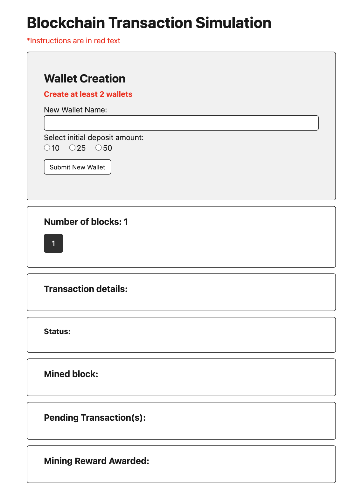

# Blockchain Transaction Simulator

### Table of Contents

- [Live Application](#live-application)
- [Description](#description)
- [Technologies](#technologies)
- [How To Use](#how-to-use)
- [Application Features](#application-features-(backend))
- [License](#license)
- [Author Info](#author-info)

## Live Application

This application can be viewed here: [guarded-plateau-05021.herokuapp.com](https://guarded-plateau-05021.herokuapp.com)

## Description

This application simulates the process of creating cryptocurrency transactions where the user has the capability to create wallets and send transactions to other wallets. The usage of a cryptographic hash function validates the transactions and blocks of the chain. Furthermore, there is a section for attempting to alter the chain, which allows the user the opportunity to view whether or not the application can successfully catch and nullify the alteration.

This application is NOT meant for real-world usage. This is simply a simulation used for educational purposes. Highly detailed transaction and block details are recorded for the user to view and learn about cryptographic technology and it's efficacy in transactional validation.

This application is based off of the following project: https://github.com/wizelineacademy/blockchain101

## Technologies

- Cryptographic hash functions
- React with React router

## How To Use

#### Installation:

1. Fork and clone this repository
2. `cd` into the newly created directory
3. Run `npm install` to install project dependencies
4. Run `npm start` to start your server

## Application Features:

| Section                                                  | Description                                                                                                         |
| -------------------------------------------------------- | ------------------------------------------------------------------------------------------------------------------- |
| Wallet Creation                                 | The user can create as many wallets as desired with 3 options for the initial deposit amount for each wallet.                                      |
| Number of blocks                                | Displays the current number of blocks in the blockchain. The first block is created by default and is known as the "Genesis Block".                                                              |
| New Transaction                       | Create a new transaction by clicking on the wallet names to auto-fill the to and from addresses and type a transaction amount. Transaction validations, such as insufficient funds or misspelled addresses, will simply result in the transaction being nullified.                                          |
| Transaction Details                         | Displays the details of the latest transaction.                                                                                  |
| Status                             | Dislays the current status of the latest block.                                                                                     |
| Mined block                 | Displays nonce and hash details on the latest block mined.                                                                         |
| Pending Transaction(s)                   | Displays the pending transaction(s), which will usually be the mining reward from the mining of the latest block.                                                                         |
| Mining Reward Awarded | Displays the amount of the latest mining reward awarded as well as the whose wallet it was awarded to.                                                                       |
| Wallet list    | Displays the current balance of each wallet in the blockchain                                                                         |
| Alter chain                              | Allows the user to alter a block on the blockchain and check for chain validity. Note: the "Genesis Block" cannot be altered.                                                                              |
| Blockchain                                      | Displays the entire blockchain in JSON format. |

## License

MIT License

Copyright (c) [2021] [Miki Saarna]

Permission is hereby granted, free of charge, to any person obtaining a copy
of this software and associated documentation files (the "Software"), to deal
in the Software without restriction, including without limitation the rights
to use, copy, modify, merge, publish, distribute, sublicense, and/or sell
copies of the Software, and to permit persons to whom the Software is
furnished to do so, subject to the following conditions:

The above copyright notice and this permission notice shall be included in all
copies or substantial portions of the Software.

THE SOFTWARE IS PROVIDED "AS IS", WITHOUT WARRANTY OF ANY KIND, EXPRESS OR
IMPLIED, INCLUDING BUT NOT LIMITED TO THE WARRANTIES OF MERCHANTABILITY,
FITNESS FOR A PARTICULAR PURPOSE AND NONINFRINGEMENT. IN NO EVENT SHALL THE
AUTHORS OR COPYRIGHT HOLDERS BE LIABLE FOR ANY CLAIM, DAMAGES OR OTHER
LIABILITY, WHETHER IN AN ACTION OF CONTRACT, TORT OR OTHERWISE, ARISING FROM,
OUT OF OR IN CONNECTION WITH THE SOFTWARE OR THE USE OR OTHER DEALINGS IN THE
SOFTWARE.

## Author Info

- GitHub: [miki-saarna](https://github.com/miki-saarna)
- LinkedIn: [Mikito Saarna](https://www.linkedin.com/in/mikito-saarna/)

[Back To The Top](#blockchain-transaction-simulator)